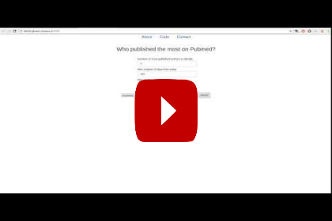

> [!IMPORTANT]
> Branches have been changed as shwon below on 2023-11-05 (Sunday).
> 
> * `original_only` -> **`main`**
> * **`master`** -> `both_versions`
> 
> The two branches differ as described below.
> 
> * In **`main`** branch, data is fetched directly from the Pubmed API.
> * In **`both_versions`** branch, data can be fetched either directly from the Pubmed API or from a local database which contains copies of those data.

# Pubmed's top authors

<a href="https://www.youtube.com/watch?v=jXctQUTaPcY" target="_blank"></a>

This is a data visualisation website. When the user types in a keyword (e.g. psychology) or an author's name, the website identifies top authors (i.e. authors who published most) on Pubmed  (1) on a keyword or (2) together with a specified author. Then, each author's publication counts are visualised in interactive plots (1) per year and (2) per journal.

# 1. Usage
## Setup
### 1. Make an account at [Cloud9](https://c9.io), and [create a workspace](https://docs.c9.io/v1.0/docs/create-a-workspace) choosing **Python** as a template.

### 2. Open a terminal (if there is none already open).

*Now, copy the command in each of the following steps and paste it into the terminal.*
<br>

### 3. download repository.

   ```
   git clone https://github.com/gknam/pubmed-top-authors.git
   ```

### 4. Go into the repository.

   ```
   cd pubmed-top-authors
   ```

### 5. Install required packages
   
   ```
   sudo pip3 install -r requirements.txt
   ```

### 6. Setup Flask
   
   ```
   export FLASK_APP=application.py
   ```
   
   ```
   export FLASK_DEBUG=1
   ```

### 7. Start server

   ```
   flask run --host=0.0.0.0 --port=8080
   ```

### 8. Open website

   Go to `Preview` --> `Preview Running Application`

## Kill server

To kill the server, do the following with the the **terminal in which** `flask` **command is running**.

* Click anywhere in the terminal and press `Ctrl` + `C`.
* Close the terminal

If you want to restart the server, follow the instructions in **Start server** section above.

*You might want to kill the server and restart it in case you want to stop a search and do a new one. Search will be slower with bigger numbers typed in "Max number of days from today and/or "Max number of articles to check" on the website.*

# 2. Technical notes

## Languages, packages and framework used
* Backend
   * Python
       * [Flask](http://flask.pocoo.org/)
   * SQLite3 (via Python's [SQLAlchemy](https://www.sqlalchemy.org/))
   * [xml.etree.ElementTree](https://docs.python.org/3/library/xml.etree.elementtree.html)
* Frontend
   * HTML
   * CSS
   * JavaScript
       * [D3.js](https://d3js.org/)
       * [jQuery](https://jquery.com/)
       * [jQueryUI](https://jqueryui.com/)
       * [Bootstrap](https://getbootstrap.com/)
       * [typeahead.js](https://twitter.github.io/typeahead.js/)
       * [Handlebars.js](https://handlebarsjs.com)

## Procedure

### 1. User submits query (front-end)

The user types in a keyword (e.g. psychology) or an author's name in the search bar. The user can also specify the (1) data fetching method - which will be explained below - , (2) number of top authors to identify, (3) date range going backwards from today, and (4) maximum number of articles (i.e. publications) to check. The set of search criteria are sent to the back-end in JSON format.

jQuery is used for simplified syntax.

### 2. Identify publications (back-end)

In the back-end, publications that match the search criteria are identified.

### 2. Fetch data (back-end)

Data are fetched for each identified publication. The fetched data include various details of each publication (e.g. author name, publication year, journal title, etc.).

Data are downloaded from Pubmed's database via [Pubmed API](https://www.ncbi.nlm.nih.gov/books/NBK25501/) as XML files. From the XML files, relevant elements (i.e. information) are **E**xtracted using [xml.etree.ElementTree](https://docs.python.org/3/library/xml.etree.elementtree.html), then **T**ransformed into a Python [dictionary](https://docs.python.org/3.7/tutorial/datastructures.html?highlight=dictionary#dictionaries). 

*Pro: Fetched data are reliable because this accesses the original database*

*Cons: Retrieving data via Pubmed API can be slow especially when the query range (date range, maximum number of articles) is big. Also, Pubmed API sets a rather tight limit on query range.*

### 3. Identify top authors (back-end)

Within the fetched data, top authors are identified who have most publications (1) on the specified keyword or (2) together with the specified author. Then, the top authors' data are sent to the front-end in JSON format.

### 4. Reorganise and visualise top authors' data (front-end)

Data are reorganised. Then, using [D3.js](https://d3js.org/), each author's publication counts are visualised in interactive plots (1) per year and (2) per journal.
